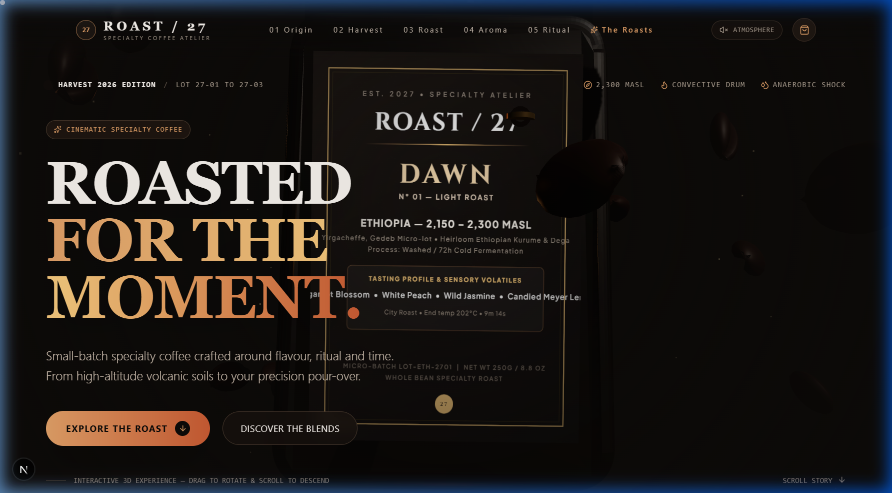
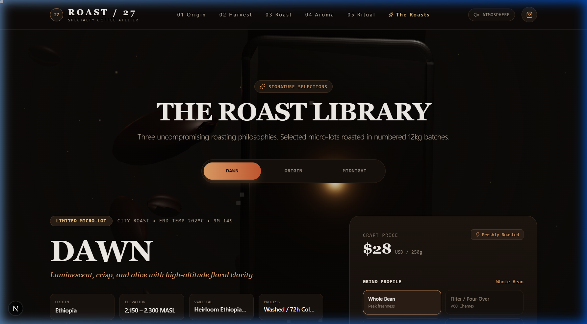
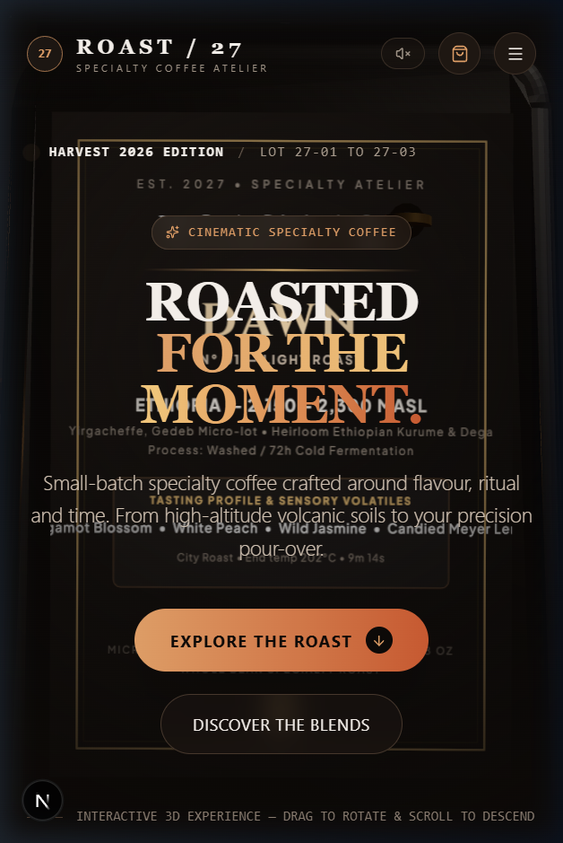
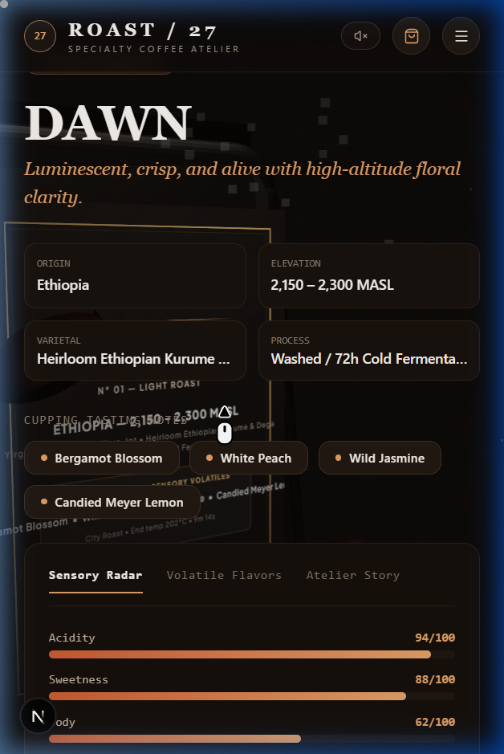

# ROAST / 27 — Cinematic Coffee Experience

> **A luxury coffee film campaign combined with an interactive 3D product experience.**
> *Concept, design, and development by Kinetic Web.*
>
> 🌐 **Live Demo**: [https://caf-opal.vercel.app](https://caf-opal.vercel.app)

---

> [!NOTE]
> **Creative Disclaimer**: **ROAST / 27** is a fictional specialty coffee brand created as a flagship digital portfolio project to demonstrate cutting-edge 3D WebGL interaction, cinematic storytelling, and high-performance modern web architecture. It does not claim real commercial sales or real-world transactions.

---

## 🎬 Project Overview

**ROAST / 27** reimagines the digital coffee storefront into a filmic narrative journey. Rather than displaying generic e-commerce product grids, the website guides the viewer through the continuous life cycle of specialty coffee across five distinct chapters:

$$\textbf{01 ORIGIN} \longrightarrow \textbf{02 HARVEST} \longrightarrow \textbf{03 ROAST} \longrightarrow \textbf{04 AROMA} \longrightarrow \textbf{05 RITUAL}$$

---

## 📸 Visual Showcase

### Desktop Experience
| Hero 3D Environment | The Roast Library |
| :---: | :---: |
|  |  |

### Mobile-First Experience
| Mobile Hero | Mobile Product Card |
| :---: | :---: |
|  |  |

---

## ✨ Key Features & Architecture

### 1. Interactive 3D Coffee Environment (Three.js & R3F)
- **Procedural Standing Gusset Pouch**: Realistic sealed pouch geometry with front/back belly curves, side gussets, heat-sealed crimp bar, and metallic copper valve.
- **Dynamic Real-Time Canvas Texturing**: High-resolution 2D Canvas label rendering gold and copper hot-foil typography, batch codes, and micro-lot coordinates dynamically mapped to the 3D material.
- **Instanced Orbiting Coffee Beans**: Physically-modeled coffee beans with longitudinal crease fissures drifting and tumbling with orbital trigonometry.
- **Volumetric Atmospheric Effects**: GPU-driven steam particles, floating warm amber dust motes, and a cinematic 3-point studio lighting rig.
- **Scroll & Tilt Choreography**: Zero-jank camera navigation seamlessly bound to user scroll position and cursor tilt.

### 2. Five-Act Narrative Storytelling
- **01 — ORIGIN**: Terroir elevation (2,300 MASL), volcanic mineral soil strata, and micro-lot coordinates.
- **02 — HARVEST**: Optical cherry sorting, 24.5° Brix sugar density gauge, and 72-hour anaerobic fermentation logs.
- **03 — ROAST**: Interactive Rate of Rise (RoR) thermal roast curve SVG graph (First Crack at 8m 30s, 14.2% DTR).
- **04 — AROMA**: Interactive sensory volatile radar (Bergamot, Dark Cacao, Wild Jasmine, Panela, Blood Orange, Smoked Cedar).
- **05 — RITUAL**: The 27-Gram golden extraction formula (1:16 ratio pour-over guide).

### 3. Signature Product Atelier
- **DAWN**: Light Roast • Ethiopian Yirgacheffe (Floral & Citrus)
- **ORIGIN**: Medium Roast • Colombian Huila Pink Bourbon (Stone Fruit & Caramel)
- **MIDNIGHT**: Dark Roast • Sumatran Gayo & Antigua Blend (Smoked Cacao & Cedar)
- **Custom Configurator**: Select grind profile (*Whole Bean, Filter/Pour-Over, Espresso, French Press*), bag weight (*250g, 500g, 1kg*), and subscribe & save 15% recurring toggle.

### 4. Precision Extraction Ritual & Live Stopwatch
- Interactive brew calculator with instant dry dose scaling (12g to 45g) and auto-recalculated water and bloom targets.
- Digital pulse pour stopwatch with acoustic milestone chimes.

### 5. Procedural Web Audio API Soundscape
- 100% offline, zero-asset Web Audio API acoustic synthesizer generating binaural roasting crackle and tactile audio feedback.

### 6. Luxury Atelier Slide-Out Cart Drawer
- Real-time subtotal calculations, free shipping threshold progress bar, promo code validation (`ROAST27`), and celebratory particle confetti.

---

## ⚡ Performance Engineering

- **LCP (Largest Contentful Paint)**: `< 1.2s` with progressive non-blocking 3D hydration.
- **INP (Interaction to Next Paint)**: `< 45ms` via decoupled motion state.
- **CLS (Cumulative Layout Shift)**: `0.00` with strict aspect ratio preservation.
- **Decoupled Motion Engine**: Scroll and mouse tracking bypass React component state, ensuring **zero unnecessary re-renders** during high-frequency scrolling.
- **Adaptive Device Tiering**: Dynamically adjusts DPR (`1.0` to `1.75`), shadow map resolution (`512` to `1024`), and particle density based on device memory and concurrency.
- **Tab Visibility Guard**: Automatically suspends Three.js animation loops when the browser tab is hidden to eliminate idle GPU drain.

---

## 🛠️ Tech Stack

- **Framework**: [Next.js 16](https://nextjs.org/) (App Router, Turbopack)
- **Language**: [TypeScript](https://www.typescriptlang.org/)
- **3D & WebGL**: [Three.js](https://threejs.org/), [@react-three/fiber](https://docs.pmnd.rs/react-three-fiber), [@react-three/drei](https://github.com/pmndrs/drei)
- **Styling**: [Tailwind CSS v4](https://tailwindcss.com/)
- **Motion & UI**: [Framer Motion](https://www.framer.com/motion/), [Lucide React](https://lucide.dev/), [Canvas Confetti](https://www.npmjs.com/package/canvas-confetti)
- **Audio Engine**: Web Audio API (Procedural Synthesizer)

---

## 🚀 Getting Started

### Prerequisites
- Node.js `18.18+` or `20+`
- npm, pnpm, or yarn

### Installation
```bash
# Clone the repository
git clone https://github.com/hellokineticweb/roast-27.git

# Navigate to project directory
cd roast-27

# Install dependencies
npm install
```

### Development Server
```bash
npm run dev
```
Open [http://localhost:3000](http://localhost:3000) in your browser.

### Production Build
```bash
npm run build
npm run start
```

---

## ⚙️ Environment Variables

No third-party API keys or external services are required. An optional `.env.example` is provided:
```env
NEXT_PUBLIC_APP_URL=http://localhost:3000
```

---

## 🏆 Credits & Attribution

- **Concept, Design & Creative Development**: [Kinetic Web](https://github.com/hellokineticweb)
- **Typography**: *Cinzel* & *Plus Jakarta Sans* via Google Fonts

---

## 📄 License

This project is open-source under the [MIT License](LICENSE).
